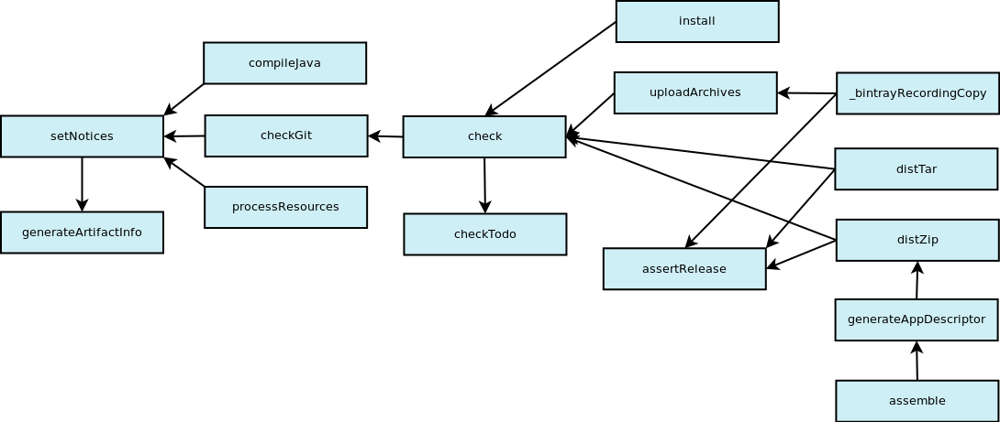

# Aurora

_Elegant Gradle projects for the JVM_

## Introduction

Aurora is a plugin for Gradle that quickly configures a JVM project hosted on GitHub, with optional support for several plugins:

- [Scala](https://docs.gradle.org/current/userguide/scala_plugin.html)

- [Groovy](https://docs.gradle.org/current/userguide/groovy_plugin.html)

- [maven](https://docs.gradle.org/current/userguide/maven_plugin.html)

- [application](https://docs.gradle.org/current/userguide/application_plugin.html)

- [Bintray](https://github.com/bintray/gradle-bintray-plugin)

- [TODO](https://github.com/AutoScout24/gradle-todo-plugin)

- [MoonLicense-Gradle](https://github.com/giancosta86/MoonLicense-Gradle)

- [MoonDeploy-Gradle](https://github.com/giancosta86/MoonDeploy-Gradle)

Support for a plugin is enabled only if Aurora detects that such plugin has been applied to the project.

The supported languages are currently:

- **Scala**

- **Groovy**

- **Java**

Aurora's goal is to reduce boilerplate configuration, by providing the following automatic features - _enabled only when the related projects are available_:

- DSL-based configuration

- Check project constraints (e.g.: **project.description** must be set)

- Set **project.ext.url** to the GitHub page of the project - GitHub's project name is assumed equal to **project.name**

- Set **project.ext.isRelease** to _true_ if **project.version** ends with **-SNAPSHOT**

- Set **project.groupId** to the string representation of _project.group_. It cannot be null or empty

- Set **project.artifactId** to the string value of _project.archivesBaseName_. It cannot be null or empty, and must be lowercase

- Add a **generated** source set, located in the **src/generated** directory tree, for Aurora tasks and for other plugins that generate source files and resources. Such directory is automatically removed by the **cleanGenerated** task as well as by the **clean** task

- The output of the **generated** source set is added to _compileClasspath_ and _runtimeClasspath_ of the default source sets (**main** and **test**), as well as to **run**'s classpath (provided by the _application_ plugin)

- Generate an **ArtifactInfo** class/object, providing information about the project. It will be located under **src/generated**:

  - generally, in a subpackage named according to the _artifact id_

  - in the root package, if the _artifact id_ matches the last component of the root package

- Add Maven repositories to locate dependencies; the following repositories will be added - in order:

  1. Maven local

  2. Maven Central

  3. [Hephaestus](XXX)

- Setup a _sources_ and a _Javadoc_ jar, for Maven deployment. The actual documentation task (**scaladoc**, **groovydoc** or **javadoc**) is automatically inferred

- Generate a POM including:

  - **name**

  - **description**

  - **url**

  - **developers**

  - **scm**

  - _dependencies_

- Setup Bintray deployment, using the project information and a few sensible defaults:

  - **publish** = false

  - **dryRun** = false

  - **pkg/publicDownloadNumbers** = false

  - **pkg/githubRepo** = **auroraSettings.gitHubUser**/**project.name**

  - **pkg/version/released** = new Date()

  - **pkg/version/gpg/sign** = true

  - **pkg/version/mavenCentralSync/publish** = false

- Read missing Bintray credentials from a file whose path can be declared in the **BINTRAY_CREDENTIALS_FILE** environment path. If existing, it must be a _.properties_ file having one or more of the following keys:

  - **bintrayUser**: your Bintray user name

  - **bintrayKey**: the password

- For _distribution_ packages generated by the **application** plugin:

  - Include files under **src/generated/dist**

  - Include scripts for ensuring the required Java version is installed and run: if the user does not have at least such version, the Java download page is opened in a browser

  - For GUI applications (the default), use **javaw** in lieu of **java** on Windows

- Starting from a **mainIcon.svg** file in the project directory, generate icon files:

  - as **resources** to be used while the program runs

  - in the **dist** directory, for the _application_ plugin

- Generate a **MainIcon** class to easily access the above icons

- The **checkTodo** task provided by the _todo_ plugin will fail if **project.isRelease** is _true_ and there are active TODOs

- Provide _info_ and _debug_ logging messages

- Setup tasks dependencies (see the graph below)

## Tasks

- **cleanGenerated**: deletes the **src/generated** directory

- **checkGit**: ensures that the project's directory status is _clean_ according to Git. It is set as a dependency of **check**. By default, it is added to the build graph _if project.isRelease is true_

- **checkDependencies**: ensures that the project does not depend on any SNAPSHOT library. By default, it is added to the build graph _if project.isRelease is true_

- **generateArtifactInfo**: generates, under **src/generated**, an artifact source file exposing the project information

- **generateAppDescriptor**: creates a [MoonDeploy](http://gianlucacosta.info/moondeploy) app descriptor based on sensible defaults, in particular:

  - Icon named **mainIcon.ico** on Windows and **mainIcon.png** on every other system

  - Directory layout based on the **application** plugin

  - **Base URL**: _project's GitHub URL_/**releases/latest**

- **generateMainIcons**: if **mainIcon.svg** exists in the project's root dir, this task creates, within **src/generated/resources/${project.groupId}/icons** the following icons by converting the original SVG:

  - _mainIcon16.png_

  - _mainIcon32.png_

  - _mainIcon64.png_

  - _mainIcon128.png_

  - _mainIcon512.png_

- **generateDistIcons**: if **mainIcon.svg** exists in the project's root dir, this task creates, within **src/generated/dist**, 2 icons, compatible with the above **generateAppDescriptor** task. More precisely:

  - _mainIcon.png_

  - _mainIcon.ico_

**generatePom**: creates a Maven POM under **build/mavenTemp**

**generateCustomStartupScripts**: creates custom startup scripts for running the app using a suitable Java version

**setupScaladoc**: provides configuration in order to prevent a few warnings issued by Scaladoc

## Task dependencies

Aurora introduces tasks and task dependencies - however, only if the necessary plugins have been applied when the **aurora{}** DSL block is run.



## Installation

At the very beginning of your build script, add:

```groovy
buildscript {
    repositories {
        mavenCentral()

        maven {
          url "http://localhost:8080/snapshots"
        }
    }

    dependencies {
        classpath 'info.gianlucacosta.aurora:aurora:CHOOSE_VERSION'
    }
}
```

To apply the plugin:

```groovy
apply plugin: 'info.gianlucacosta.aurora'
```

Aurora can be applied before or after other plugins, _but_ its **aurora{...}** DSL block must occur after every _apply_ introducing a plugin referenced by Aurora.

**NOTE**: when using Aurora with a language plugin - such as **scala** or **groovy**, you'll most probably need to add a **generatedCompile** item to your **dependencies** block, usually referencing the same compiler library as **compile** - in particular:

- _org.scala-lang:scala-library:YOUR_SCALA_VERSION_ for Scala

- _localGroovy()_ (or a specific Groovy version) for Groovy

## Usage

Aurora will perform most of its configuration (excluding mainly repository and task declarations) when reaching its (mandatory) DSL block:

```groovy
aurora {
    gitHubUser  = "<GitHub user id>"

    docTask = "javadoc" //or "groovydoc", or "scaladoc", ... OPTIONAL (it is inferred)

    commandLineApp = false //OPTIONAL. Default: false

    author {
        name = "<Author name>"
        email = "<Author's e-mail address>"
        url = "<Author's url - OPTIONAL>"
    }

    customStartupScripts = true //OPTIONAL. Default: true

    commandLineApp = false //OPTIONAL. Default: false

    bintray {
        user = "<Bintray API user id - OPTIONAL>"
        key = "<Bintray API key - OPTIONAL>"

        repo = "<Target repository on Bintray>"

        licenses = ['Apache-2.0'] //The strings should follow Bintray's conventions

        labels = ["testLabel1", "testLabel2"] //Tags following Bintray's conventions
    }

    /*
    This example makes Java 1.8.0_65 or later required to run the application.
     OPTIONAL - if missing, Aurora will inject the version of the JVM building the app
    */
    javaVersion {
      major = 1  //Default: 0
      minor = 8 //Default: 0
      build = 0 //Default: 0
      update = 65 //Default: 0
    }

    /*
    Execution arguments for both the JVM and the app. OPTIONAL (it defaults to empty lists)
    */
    runArgs {
      jvm = ["-ea"] //Arguments for the JVM. OPTIONAL (defaults to an empty list)

      app = ["Alpha", "Beta"] //Arguments for the app. OPTIONAL (defaults to an empty list)
    }
}
```

### Settings

- **gitHubUser**: GitHub user hosting the project.
  _It is assumed that the repository on GitHub is named like the project_ (more precisely, its name must be **project.name**)

- **docTask**: the task providing the files for the Javadoc archive. It is _optional_, as it is automatically inferred according to your language-related plugins. Usual values will be:

  - **javadoc** for Java

  - **groovydoc** for Groovy

  - **scaladoc** for Scala

- **release**: determines whether the build process will create artifacts suitable for release. The default value is _true_. This flag controls several aspects of the plugin

- **commandLineApp**: if _false_ (the default) **javaw** will be used instead of **java**, on Windows, when generating the **application** distribution

- **author** can be used one or more times to add authors to the project. Each **author** block requires:

  - **name**: the author's name

  - **email**: the author's e-mail address

  - **url**: the author's url. (OPTIONAL)

- **bintray**: settings passed to the _bintray_ block provided by the Bintray plugin. In particular:

  - **user**: the authentication user id. OPTIONAL - can be read from a properties file (see above)

  - **key**: the authentication key. OPTIONAL - can be read from a properties file (see above)

  - **repo**: the repository name

  - **licenses**: a list of license strings, complying with Bintray's format

  - **labels**: the label tags to be shown on Bintray

**customStartupScripts**: creates Aurora-specific startup scripts in lieu of the default ones provided by Gradle's _application_ plugin. OPTIONAL - the default is _true_

**javaVersion**: used by the _custom startup scripts_ to check that the required Java version (or later) is installed. If missing, the current JVM version will be chosen

**runArgs**: JVM- and app-related arguments. Please refer to the example configuration above for more details

## Example projects

Aurora is employed in a wide variety of open source projects - both libraries and applications:

- [EighthBridge](https://github.com/giancosta86/EighthBridge)

- [GraphsJ](http://gianlucacosta.info/GraphsJ/)

- [Chronos programming language](https://github.com/giancosta86/Chronos)

- [Chronos IDE](http://gianlucacosta.info/Chronos-IDE/)

- [KnapScal](http://gianlucacosta.info/KnapScal/)

- [KnapScal-core](https://github.com/giancosta86/KnapScal-core)

## Further references

- [MoonDeploy](http://gianlucacosta.info/moondeploy/)

- [MoonLicense](https://github.com/giancosta86/MoonLicense)

- [Hephaestus](XXX)
